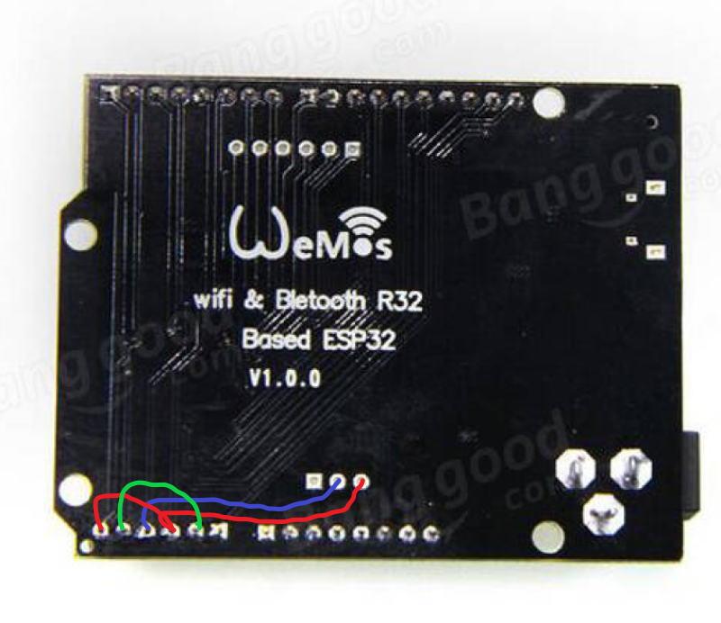
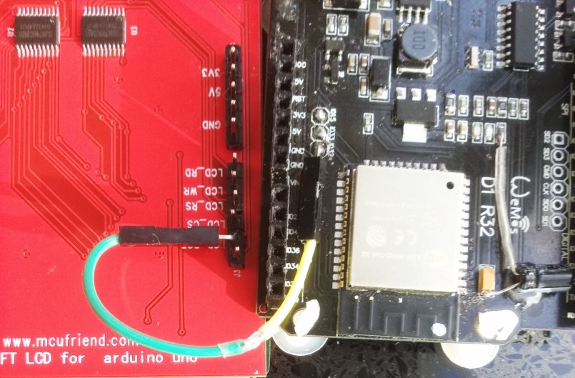
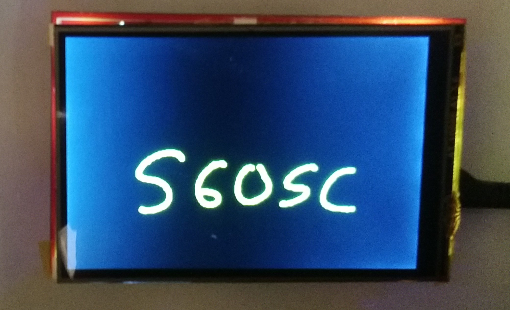

# Adafruit TouchScreen with mod for ESP32 UNO

This is the 4-wire resistive touch screen firmware for Arduino. Works with all Arduinos and Teensy


To install, click DOWNLOAD SOURCE in the top right corner, and rename the uncompressed folder "TouchScreen". See our tutorial at http://www.ladyada.net/library/arduino/libraries.html on Arduino Library installation

Added modification to allow the 4-wire resistive touchscreen of MCU Friend LCDs with parallel data interfaces to be used with ESP32 UNO style boards whilst WiFi is enabled. Tested on a red board MCU Friend with default touchscreen wiring.


## Reason for Modification

ESP32 WiFi removes access to ADC2 channel so pins 4 and 15 attached to the touchscreen no longer have analog input capability. ADC1 channel pins 36 and 39 are therefore connected to pins 4 and 15 to provide the analog input. Pins 36 and 39 are input only so always present a high impedance to avoid the risk of two outputs shorting.

## Prerequisites

The following wiring mods are needed which are different to those shown in the [TFT_eSPI](https://github.com/Bodmer/TFT_eSPI)  instructions but dont affect the software functionality or configuration.

Wiring for ESP UNO type board:

   


Connection to MCU Friend board:

Solder an angled pin to IO32.
Bend over LCD_RST pin and connect to IO32 pin using jumper before joining boards.

    


## Installing

Download and install the library using your IDE, eg Arduino. 
The modification uses conditional compilation. To enable the changes, modify TouchScreen.h to uncomment #define ESP32_WIFI_TOUCH

```
// ESP32 specific 
//#define ESP32_WIFI_TOUCH // uncomment to use parallel MCU Friend LCD touchscreen with ESP32 UNO Wifi
#ifdef ESP32 
#define ADC_MAX 4095  // maximum value for ESP32 ADC (default 11db, 12 bits)
#define aXM 39  // analog input pin connected to LCD_RS 
#define aYP 36  // analog input pin connected to LCD_WR
#else
#define ADC_MAX 1023  // Arduino
#endif 
#define NOISE_LEVEL 4  // Allow small amount of measurement noise
```


## Using

No changes are required to existing sketches, just recompilation.

Compatible with both [TFT_eSPI](https://github.com/Bodmer/TFT_eSPI) and [MCUFRIEND_kbv](https://github.com/prenticedavid/MCUFRIEND_kbv/) libraries

Touchscreen needs to be calibrated before use, either manually using included [ESP32testTouch](examples/ESP32testTouch) or eg  [TouchScreen_Calibr_native](https://github.com/prenticedavid/MCUFRIEND_kbv/tree/master/examples/TouchScreen_Calibr_native)

   
